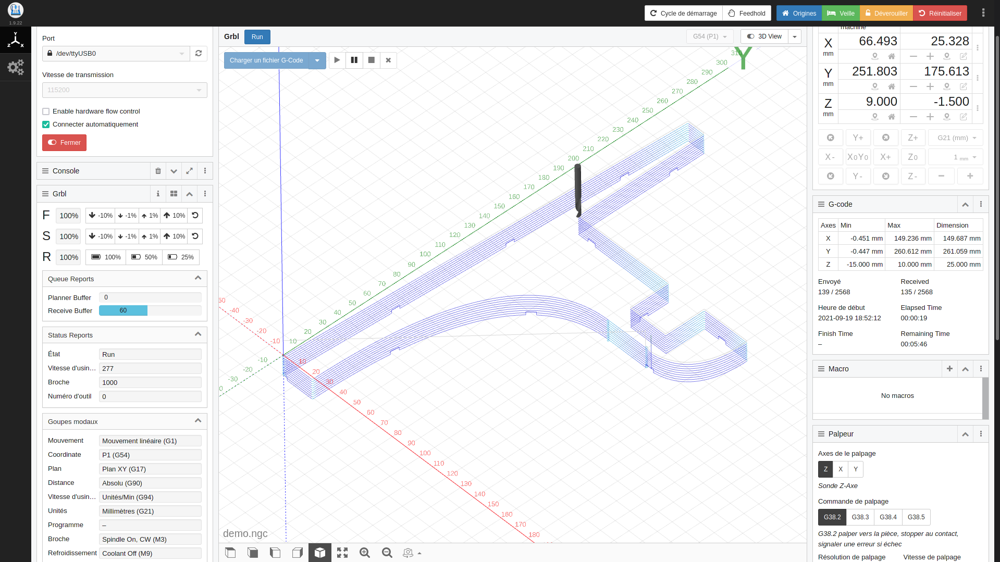

# svg2gcode

svg2gcode reads an SVG file and produces g-code machining operations
from the paths in it.

Supported operations are:

* engraving (follow the path from the SVG)

* offset (follow a path offset inwards or outwards from the SVG path)

* pocket (clear the interior of the path from the SVG)

* drill (in the center of circular paths)

Features:

* ramp or plunge entry moves

* optionally add work-holding tabs

* primitive nesting via duplication on an XY grid

## Installation

Clone the svg2gcode repo:

    git clone https://github.com/SebKuzminsky/svg2gcode.git

Install dependencies:

    sudo apt-get install python3 python3-svgwrite python3-numpy python3-jsonschema asciidoc docbook-xml docbook-xsl xsltproc make

    pip install svgpathtools

## Supported CNC controller:

GRBL: https://github.com/gnea/grbl

## Tests

Run the test suite:

Test the GCODE comparing the expected.ngc file with a result.ngc file generated during the test.

    cd test; ./runtests_parallel

Test the GCODE expected.ngc with an Arduino board (testing takes a lot of time).

    runtests_grbl.py

# G-Coder Python module

This repo also contains a python module named `gcoder` that writes g-code.

It is intended to be called from a program that has an idea of some
cuts it wants to make.  Gcoder functions write g-code to an output file.
Some Gcoder functions correspond directly to specific g-codes, and some
to more complex operations consisting of longer sequences of g-codes.
