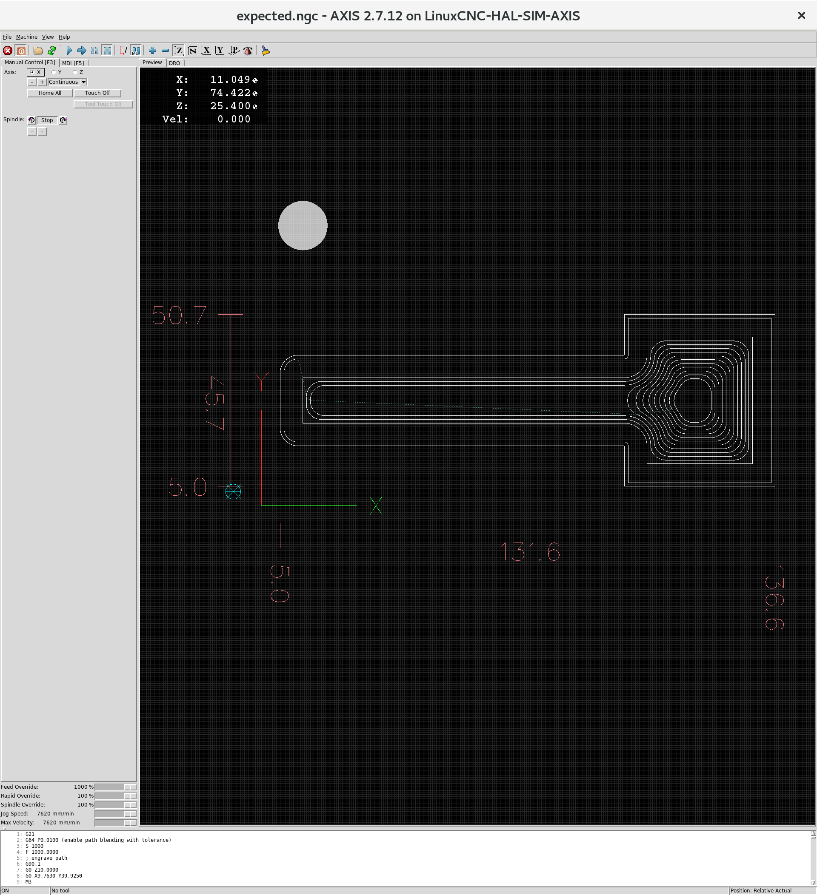

# svg2gcode

svg2gcode reads an SVG file and produces g-code machining operations
from it.

## Installation

Clone the svg2gcode repo:

    git clone https://github.com/SebKuzminsky/svg2gcode.git
    git submodule init
    git submodule update

Install dependencies:

    sudo apt-get install python python-cairosvg python-svgwrite python-numpy asciidoc docbook-xml docbook-xsl xsltproc

The test suite runs the LinuxCNC Standalone Interpreter to validate
the emitted g-code, this is available in the `linuxcnc-uspace` package
from the linuxcnc.org deb archive.

Add the GPG key that validates the linuxcnc.org deb archive:

    sudo apt-key adv --keyserver hkp://keys.gnupg.net --recv-key 3cb9fd148f374fef

Add the apt source for the linuxcnc.org deb archive:

    deb http://linuxcnc.org stretch base 2.7-uspace

Install the `linuxcnc-uspace` package:

    sudo apt-get install linuxcnc-uspace

Build the manpage:

    make

## Engrave operation

The "engrave" operation produces g-code that traces the paths in the
input SVG file.

Takes no parameters.

## Offset operation

The "offset" operation produces g-code that traces a path parallel to
the paths in the input SVG file.

Parameters:

* `distance`: The offset distance.

## Pocket operation

The "pocket" operation clears the area inside the paths in the input
SVG file.  This consists of a number of cuts:

1. The first cut is a slot, inset from the input path by the
    `finishing-allowance` parameter plus the tool radius (half of the
    `tool-diameter` parameter)

2. The pocket operation next makes a sequence of cuts to clear the
    interior of the pocket.  Each cut's path is inset from the previous
    cut's path by the `width-of-cut` parameter.

In the end, the finishing allowance is left on the pocket walls.

Parameters:

* `tool-diameter`: The diameter of the cutting tool.

* `width-of-cut`: Radial width of cut.

* `finishing-allowance`: How much material to leave on the pocket
    walls (to be cleaned up by a different finishing operation later).
    Omit this parameter or set it to 0 to leave nothing behind.

# G-Coder Python module

This is a python module that writes g-code.  It is intended to be
called from a program that has an idea of some cuts it wants to make.
G-coder functions write g-code to an output file.  Some G-coder
functions correspond directly to specific G-codes, and some to more
complex operations consisting of longer sequences of g-codes.
