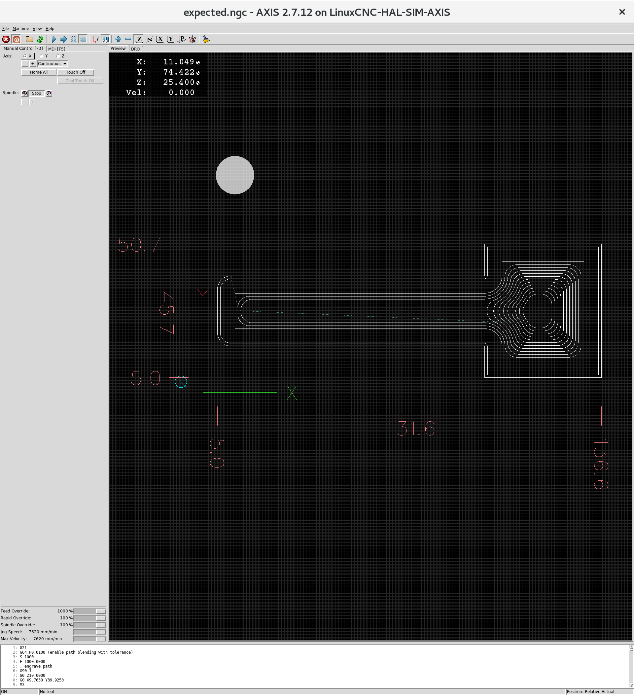
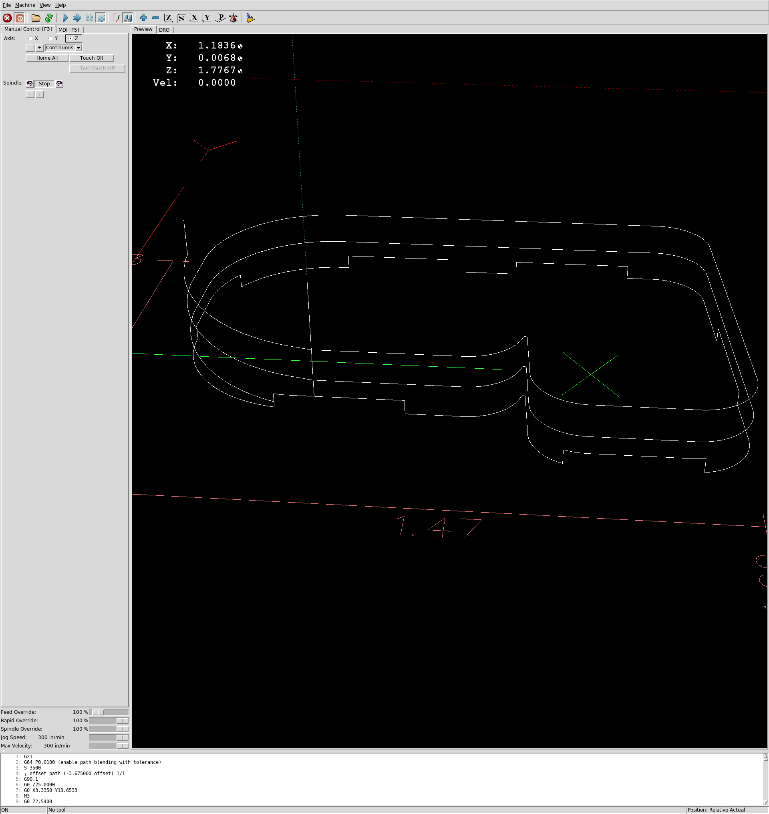

# svg2gcode

svg2gcode reads an SVG file and produces g-code machining operations
from the paths in it.

Supported operations are:

* engraving (follow the path from the SVG)

* offset (follow a path offset inwards or outwards from the SVG path)

* pocket (clear the interior of the path from the SVG)

* drill (in the center of circular paths)

Features:

* ramp or plunge entry moves

* optionally add work-holding tabs

## Installation

Clone the svg2gcode repo:

    git clone https://github.com/SebKuzminsky/svg2gcode.git
    git submodule init
    git submodule update

Install dependencies:

    sudo apt-get install python python-svgwrite python-numpy asciidoc docbook-xml docbook-xsl xsltproc

The test suite runs the LinuxCNC Standalone Interpreter to validate
the emitted g-code, this is available in the `linuxcnc-uspace` package
from the linuxcnc.org deb archive.

Add the GPG key that validates the linuxcnc.org deb archive:

    sudo apt-key adv --keyserver hkp://keys.gnupg.net --recv-key 3cb9fd148f374fef

Add the apt source for the linuxcnc.org deb archive:

    deb http://linuxcnc.org stretch base 2.7-uspace

Install the `linuxcnc-uspace` package:

    sudo apt-get install linuxcnc-uspace

Build the manpage:

    make

# G-Coder Python module

This repo also contains a python module named `gcoder` that writes g-code.

It is intended to be called from a program that has an idea of some
cuts it wants to make.  Gcoder functions write g-code to an output file.
Some Gcoder functions correspond directly to specific g-codes, and some
to more complex operations consisting of longer sequences of g-codes.
